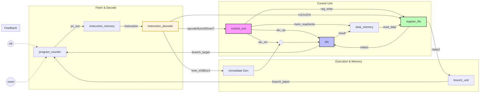

# RISC-V Processor in Verilog

A single-cycle RISC-V processor implementation in Verilog, with plans to evolve into a pipelined design.

## Current Status
- [ ] Single-cycle implementation
- [ ] RV32I base instruction set
- [ ] Basic testing

## Architecture
(Coming soon)

## How to Run
(Coming soon)

## Resources
- RISC-V ISA Spec: https://riscv.org/technical/specifications/
- RISC-V Card: https://www.cs.sfu.ca/~ashriram/Courses/CS295/assets/notebooks/RISCV/RISCV_CARD.pdf
- RISC-V Reader

Cool Encoder Website I found: 
https://luplab.gitlab.io/rvcodecjs/#q=BEQ+x1,+x1,+-12&abi=false&isa=AUTO