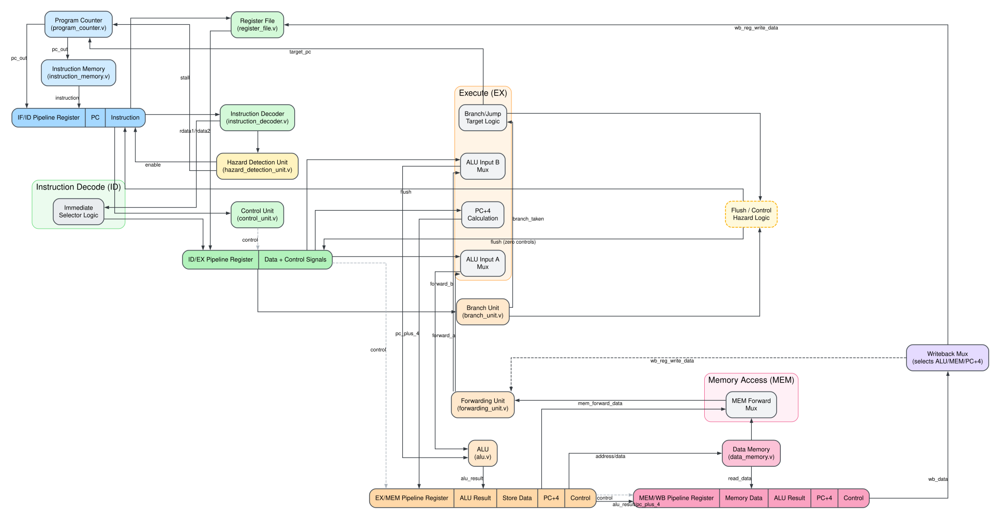

# RISC-V Five-Stage Pipelined Processor

[]()
[]()
[]()
[]()

A fully functional five-stage pipelined RISC-V processor implementing the RV32I base integer instruction set. This project extends my [single-cycle RISC-V processor](https://github.com/mvvillarrealblozis/riscv-processor) with a in-order pipelined microarchitecture to achieve improved throughput through overlapped instruction execution.

## Overview

This processor implements a traditional five-stage pipeline (IF → ID → EX → MEM → WB) with hazard detection and pipeline control logic. All three types of pipeline hazards are handled: structural hazards (avoided by design), data hazards (forwarding + stalling), and control hazards (flushing).

### Implemented Features

- Five-stage in-order pipeline (IF, ID, EX, MEM, WB)
- Dedicated IF/ID, ID/EX, EX/MEM, and MEM/WB pipeline registers
- EX/MEM and MEM/WB forwarding paths for RAW hazard resolution
- Load-use hazard detection with single-cycle stall insertion
- Branch and jump flush control for control hazard recovery
- Modular Verilog RTL hierarchy for datapath and control logic
- Directed self-checking testbench validating pipeline hazards and RV32I execution
- Synthesized using Yosys targeting the Sky130 open-source PDK

## Architecture

### Pipeline Stages

| Stage | Function | Critical Operations |
|-------|----------|---------------------|
| **IF** (Instruction Fetch) | Fetch instruction from memory | PC update, instruction memory read |
| **ID** (Instruction Decode) | Decode and read registers | Instruction decode, control signal generation, register file read |
| **EX** (Execute) | Perform computation | ALU operations, branch comparison, address calculation |
| **MEM** (Memory) | Access data memory | Load/store operations |
| **WB** (Write Back) | Write results to registers | Register file write |

### Pipeline Diagram



*Figure: Five-stage pipeline showing all modules, forwarding paths (dashed lines), and control hazard handling.*

### Hazard Handling

**Data Hazards:**
- **Forwarding paths** resolve most RAW (Read-After-Write) hazards with zero-cycle penalty
  - EX/MEM → EX (forward ALU result to dependent instruction)
  - MEM/WB → EX (forward memory data or older ALU result)
- **Load-use stalls** insert one bubble when an instruction immediately uses a load result

**Control Hazards:**
- **Branch resolution** occurs in EX stage (2-cycle branch penalty)
- **Pipeline flushing** converts wrong-path instructions to NOPs
- Flush targets: IF/ID and ID/EX registers (2 instruction slots)

**Structural Hazards:**
- Avoided by design (separate instruction/data memories, register file with write-before-read)

## Performance Characteristics

**Measured Performance:**
- **CPI:** ~1.2-1.4 (varies with program mix)
  - Ideal case: 1.0 (no hazards)
  - Load-use: +1 cycle stall
  - Branch taken: +2 cycles (flush penalty)
- **Branch Penalty:** 2 cycles (late resolution in EX stage)
- **Throughput:** Near-ideal after pipeline fill (5-cycle startup latency)

**Comparison to Single-Cycle:**
- Single-cycle: CPI = 1.0, limited by longest instruction path
- Pipelined: CPI = ~1.2-1.4, but with shorter clock period → higher throughput

## Synthesis and Timing Analysis

The processor RTL was synthesized using Yosys targeting the Sky130 open-source standard-cell library.

### Post-Synthesis Statistics

- Estimated operating frequency: ~100 MHz
- Pipeline register count: 466 flip-flops
- Register file: 32 × 32-bit general-purpose registers
- Data memory: 256 × 32-bit memory array
- Instruction memory: synthesized ROM model

### Timing Observations

- Decode-stage register file muxing produced the dominant combinational timing path
- Branch resolution in EX reduced decode-stage complexity at the cost of a 2-cycle branch penalty
- Forwarding logic increased EX-stage mux depth but minimized data hazard stalls

Component Breakdown:
| Module | Logic Gates | Flip-Flops |
|--------|-------------|------------|
| ALU | 794 | 0 |
| Branch Unit | 280 | 0 |
| Control Unit | 53 | 0 |
| Forwarding Unit | 86 | 0 |
| Hazard Detection | 48 | 0 |
| Pipeline Registers (IF/ID, ID/EX, EX/MEM, MEM/WB) | 0 | 466 |
| Program Counter | 0 | 32 |
| Register File (32×32) | 4,089 | 992 |
| Data Memory (256×32) | 24,922 | 8,192 |
| Instruction Memory | 189 | 0 |

Pipeline Behavior
- Most RAW dependencies resolved through EX/MEM and MEM/WB bypass paths
- Load-use hazards incur a single-cycle stall
- Taken branches and jumps flush two pipeline stages
- Pipeline achieves near one-instruction-per-cycle throughput in dependency-free instruction streams

## Verification

The processor was verified using directed simulation-based testing in Icarus Verilog.

Verification scenarios included:

- Arithmetic and logical instruction execution
- Register dependencies and forwarding behavior
- Load-use hazard detection and stall insertion
- Branch and jump pipeline flushing
- Multi-instruction dependency chains
- Control-flow correctness for JAL and JALR operations

Waveform analysis in GTKWave was used to debug pipeline timing, forwarding selection, and control propagation across pipeline stages.
## Test Results

All 8 test programs pass, validating correct hazard handling:

| Test | Description | Validates |
|------|-------------|-----------|
| **Test 1** | EX Hazard | EX-to-EX forwarding |
| **Test 2** | MEM Hazard | MEM-to-EX forwarding |
| **Test 3** | Load-Use | Stall + forward on load dependency |
| **Test 4** | Complex Dependencies | Multiple forwarding paths |
| **Test 5** | Branch Taken | Pipeline flush on taken branch |
| **Test 6** | Branch Not Taken | No flush when branch not taken |
| **Test 7** | JAL | Unconditional jump with return address |
| **Test 8** | JALR | Register-indirect jump |

**Sample Output:**
```
Test 1 (EX Hazard):      x1=5, x2=15     (Expected: 5, 15)      ✓
Test 2 (MEM Hazard):     x3=5, x4=15     (Expected: 5, 15)      ✓
Test 3 (Load-Use):       x5=32, x6=42    (Expected: 32, 42)     ✓
Test 4 (Complex):        x7=5, x8=15, x9=20 (Expected: 5, 15, 20) ✓
Test 5 (Branch Taken):   x10=5, x11=5, x12=0, x13=0, x14=10      ✓
Test 6 (Branch Not Taken): x15=5, x16=10, x17=1, x18=2           ✓
Test 7 (JAL):            x25=0x88, x19=0, x20=0, x21=10          ✓
Test 8 (JALR):           x25=0x88, x22=16, x23=0, x24=10         ✓
ALL TESTS PASSED
```

## Project Structure
```
riscv-processor-pipelined/
├── rtl/
│   ├── top/
│   │   └── cpu.v                   # Top-level pipelined CPU
│   ├── core/
│   │   ├── alu.v                   # Arithmetic logic unit
│   │   ├── control_unit.v          # Main control logic
│   │   ├── instruction_decoder.v   # Instruction decode logic
│   │   ├── register_file.v         # 32 general-purpose registers
│   │   ├── branch_unit.v           # Branch condition evaluation
│   │   ├── forwarding_unit.v       # Data forwarding logic
│   │   ├── hazard_detection_unit.v # Load-use stall detection
│   │   └── program_counter.v       # PC register with enable
│   ├── memory/
│   │   ├── instruction_memory.v    # ROM for instructions
│   │   └── data_memory.v           # RAM for loads/stores
│   └── pipeline/
│       ├── if_id.v                 # IF/ID pipeline register
│       ├── id_ex.v                 # ID/EX pipeline register
│       ├── ex_mem.v                # EX/MEM pipeline register
│       └── mem_wb.v                # MEM/WB pipeline register
└── testbench/
    ├── top/
    │   └── cpu_testbench.v         # Comprehensive CPU test suite
    ├── core/                       # Unit tests for core components
    ├── memory/                     # Unit tests for memory modules
    └── pipeline/                   # Unit tests for pipeline registers
```

## Key Design Tradeoffs

**Why forward from MEM instead of just WB?**  
Forwarding from the MEM stage reduces data hazard latency by one cycle. Without MEM forwarding, instructions would need to wait an extra cycle even though the data is available earlier.

**Why resolve branches in EX instead of ID?**  
Branch resolution requires the ALU for address calculation and comparison. Moving this to EX simplifies the ID stage and keeps the critical path balanced, though it does increase branch penalty.

**Why flush two stages instead of one?**  
When a branch is taken in EX, two wrong instructions are already in the pipeline (one in IF/ID, one in ID/EX). Both must be flushed to maintain correctness.

**Why not predict branches?**  
Static branch prediction (e.g., always-not-taken) could reduce the average penalty but adds complexity. This implementation focuses on correctness and clarity, making branch prediction a natural future enhancement.

## Getting Started

### Prerequisites
- Icarus Verilog (`iverilog`)
- GTKWave (for waveform viewing)

### Running Tests

```bash
# Compile the processor and testbench
iverilog -o cpu_test -s cpu_testbench \
    rtl/core/*.v rtl/memory/*.v rtl/pipeline/*.v rtl/top/*.v \
    testbench/top/cpu_testbench.v

# Run the test suite
vvp cpu_test

# View waveforms
gtkwave cpu_testbench.vcd
```

### Test Output

The testbench prints detailed pipeline traces and validates all 8 test cases. Look for:
- `>>> FLUSH` messages indicating control hazards
- `>>> STALL` messages indicating load-use hazards
- `Forwarding Detected` messages showing data forwarding
- Final `ALL TESTS PASSED` confirmation

## Background: Single-Cycle Processor

This pipelined processor is based on my fully functional single-cycle RISC-V implementation. See the [single-cycle version](https://github.com/mvvillarrealblozis/riscv-processor) for:
- Complete module documentation
- Detailed instruction set architecture
- Design methodology and testing approach

## Future Enhancements

**Potential Phase 4+ Improvements:**
- Branch prediction (static or dynamic)
- I-cache and D-cache with hit/miss handling
- Performance counters (cycles, instructions, stalls, flushes)
- Exception and interrupt handling
- CSR (Control and Status Register) support
- Privilege levels (M-mode, U-mode)

## Development Journey

This processor was built in three phases:

1. **Phase 1: Pipeline Structure** - Implemented five pipeline registers and basic instruction flow
2. **Phase 2: Data Hazards** - Added forwarding unit and hazard detection for RAW dependencies
3. **Phase 3: Control Hazards** - Implemented branch/jump flushing and return address handling
4. **Phase 4: Performance** *(in progress)* - Synthesis, place-and-route, and timing analysis

## Author

**Max Villarreal-Blozis**  
M.S. Electrical and Computer Engineering, UC Davis  
Specialization: Digital Design & Computer Architecture

**Connect:**
- GitHub: [@mvvillarrealblozis](https://github.com/mvvillarrealblozis)
- LinkedIn: [Max Villarreal-Blozis](https://linkedin.com/in/maxvillarrealblozis)

---

*This processor demonstrates practical understanding of pipeline hazards, forwarding networks, and control flow handling core concepts in modern CPU design.*
